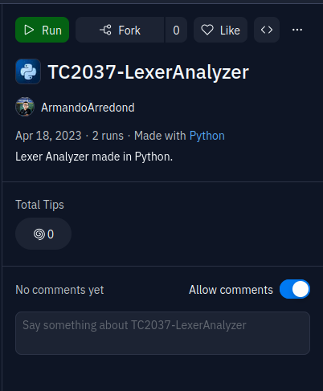

# Lexer Analyzer
## LEXER FOR PYTHON LANGUAGE
Using python creates a lexer analyzer for syntax highlight. It was made for the Implementation of Computational Methods class.


## REPLIT: https://replit.com/join/hqiwbdymay-armandoarredond

## Installation
## Replit:

Click run in replit:



## PC:

### To have a successful installation on your PC, please follow these instructions:

1. Make sure you have Python installed on your computer. You can download and install it from the official Python website if you don't already have it installed.

2. Download the program files to your computer and navigate to the directory where you saved them.

3. Open a terminal or command prompt and navigate to the directory where you saved the program files.

4. Run the following command in the terminal or command prompt to install the required dependencies:
```shell
pip install -r requirements.txt
```
This will install all the dependencies required for the program to run successfully.

5. After the dependencies have been installed, you can run the program by opening the [main.py](./Entregable-Dos/main.py) file located in the Entregable-Dos directory and running it with Python.


## How to use it
To use the lexer analyzer, you can add one or more .txt files to the directory where your [main.py](./Entregable-Dos/main.py) file is located. The lexer analyzer will automatically process each of these files and generate a stream of tokens for each one.

Once you have added your .txt files, you can run the program by opening the main.py file and clicking the "execute" button. This will run the lexer analyzer on all of the .txt files in the directory.

After the program has finished running, you should check both the console output and your workspace for the HTML file. The console output will show you the stream of tokens generated by the lexer analyzer, and the HTML file will show you the code with syntax highlighting applied.

## Tokenization
```python
  matchers = [
      match_special,
      match_operator,
      match_literal,
      match_keyword,
      match_identifier,
      match_delimiter,
      match_comment,
      match_exponentiation,
  ]
```

Once with this the code will print into an HTML file the output of the code, and will highligt each reserved word.

## Example Input file


```txt
b=7

a = 32.4 *(-8.6 - b)/       6.1E-8

d = a ^ b # Esto es un comentario

```

## Output example
### Console output
```python
+------------+-----------------------+------------+
| Token Type | Lexeme        |
+------------+-----------------------+------------+
| IDENTIFIER | b                       |
| OPERATOR   | =                       |
| LITERAL    | 7                       |
| IDENTIFIER | a                       |
| OPERATOR   | =                       |
| LITERAL    | 32.4                    |
| OPERATOR   | *                       |
| SPECIAL    | (                       |
| OPERATOR   | -                       |
| LITERAL    | 8.6                     |
| OPERATOR   | -                       |
| IDENTIFIER | b                       |
| SPECIAL    | )                       |
| OPERATOR   | /                       |
| LITERAL    | 6.1E-8                  |
| IDENTIFIER | d                       |
| OPERATOR   | =                       |
| IDENTIFIER | a                       |
| OPERATOR   | ^                       |
| IDENTIFIER | b                       |
| COMMENT    | # Esto es un comentario |
+------------+-----------------------+------------+

```


### Example Output HTML


## DFA

