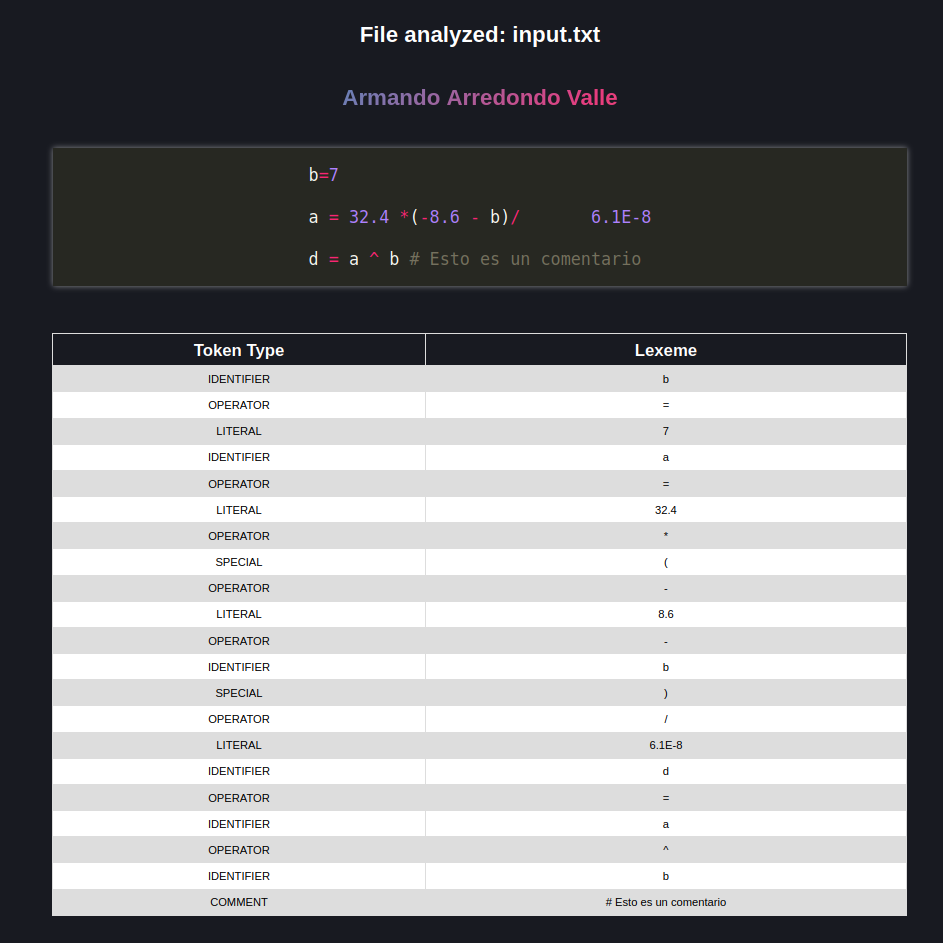
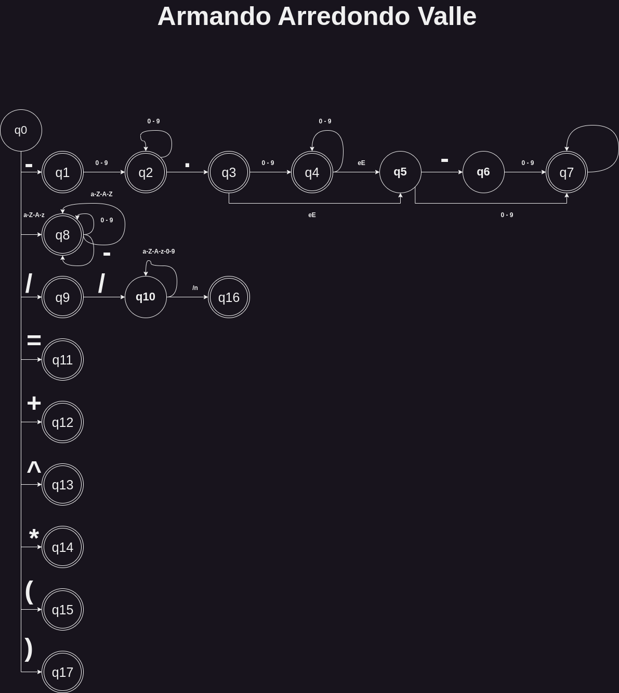

# Lexer Analyzer
## LEXER FOR PYTHON LANGUAGE
Using python creates a lexer analyzer for syntax highlight. It was made for the Implementation of Computational Methods class.

## REPLIT: https://replit.com/@ArmandoArredond/TC2037-LexerAnalyzer?v=1

## How to use it
Simply add as many `.txt` files as you want, the analyzer will be executed in auto.
Once added the txt, simply click execute in the `main.py` file for running the program. Once done **CHECK** the console, will be outputted your code, also check in your workspace for the HTML file.
## Tokenization
```python
  matchers = [
      match_special,
      match_operator,
      match_literal,
      match_keyword,
      match_identifier,
      match_delimiter,
      match_comment,
      match_exponentiation,
  ]
```

Once with this the code will print into an HTML file the output of the code, and will highligt each reserved word.

## Example Input file


```txt
b=7

a = 32.4 *(-8.6 - b)/       6.1E-8

d = a ^ b # Esto es un comentario

```

## Output example
### Console output
```python
+------------+-----------------------+------------+
| Token Type | Lexeme        |
+------------+-----------------------+------------+
| IDENTIFIER | b                       |
| OPERATOR   | =                       |
| LITERAL    | 7                       |
| IDENTIFIER | a                       |
| OPERATOR   | =                       |
| LITERAL    | 32.4                    |
| OPERATOR   | *                       |
| SPECIAL    | (                       |
| OPERATOR   | -                       |
| LITERAL    | 8.6                     |
| OPERATOR   | -                       |
| IDENTIFIER | b                       |
| SPECIAL    | )                       |
| OPERATOR   | /                       |
| LITERAL    | 6.1E-8                  |
| IDENTIFIER | d                       |
| OPERATOR   | =                       |
| IDENTIFIER | a                       |
| OPERATOR   | ^                       |
| IDENTIFIER | b                       |
| COMMENT    | # Esto es un comentario |
+------------+-----------------------+------------+

```


### Example Output HTML


## DFA

